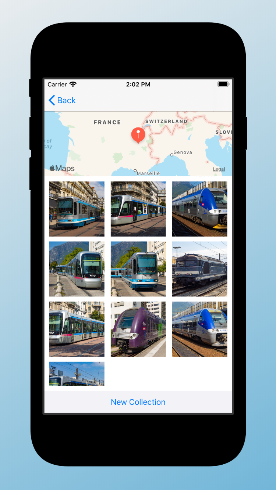

# Virtual Tourist

**Virtual Tourist** downloads and stores images from [Flickr](https://www.flickr.com/services/api/). The app allows users to drop pins on a map, as if they were stops on a tour. Users will then be able to download pictures for the location and persist both the pictures, and the association of the pictures with the pin.

## Screenshots

    
    

## License

The content of this repository is licensed under a [MIT License](LICENSE).
